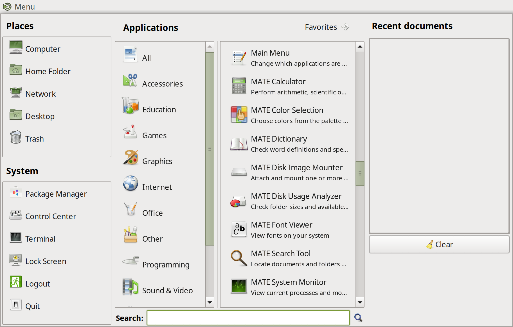

# Advanced MATE Menu

Advanced MATE Menu is an application launcher for the MATE desktop. It provides
a fast, simple menu for launching applications from the MATE panel.



## Features

* Simple application search
* Category-based browsing
* Places and recent documents
* Keyboard navigation
* Super/Windows key binding

## Installing

It's a fairly straightforward Python project, so installing is easy:

```sh
python3 setup.py build
sudo python3 setup.py install
```

## Usage

Once installed, add the menu to your panel:

1. Right-click an empty area of the MATE panel.
2. Choose **Add to Panel**.
3. Select **Advanced MATE Menu** from the list.

## Configuration

Right-click the menu button to access options such as:

* Layout and appearance
* Search behavior
* Categories to show or hide

## Reporting Issues

Found a bug or have a suggestion? Report it on the [issues
page](https://github.com/ubuntu-mate/mate-menu/issues).
